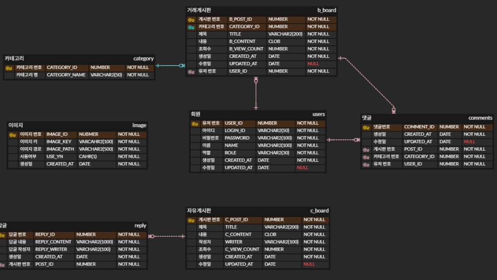

# java-miniproject-2026
- Java 웹 개발자 2026 미니프로젝트1
    - 기간: 2026.04.28 ~ 2026.05.08(5일)

## 프로젝트 인원
- 김병우(https://github.com/BuildEnough)
- 김호성(https://github.com/KHS-SK)
- 이윤범(https://github.com/leeyb12)
- 최유진(https://github.com/slw13d-ly)
- 최재화(https://github.com/spartajaden)

## 프로젝트 관리
- [issues](https://github.com/BuildEnough/java-miniproject-2026/issues): 팀원에게 문제점, 개발 건 역할 분담
- [wiki](https://github.com/BuildEnough/java-miniproject-2026/wiki): 프로젝트 문서 생성
- ~~[action]~~: 프로젝트 소스 자동 배포 등
- [projects](https://github.com/BuildEnough/java-miniproject-2026/projects?query=is%3Aopen): kanban을 사용, issues 탭에 작성한 이슈들이 바로 디스플레이

## 미니프로젝트 주제
- 커뮤니티 + 거래결합형
    - 자유게시판 + 거래게시판
    - 댓글/좋아요~
    - 캘린더

## 요구사항 정의
- [요구사항 링크](./docs/PRD.md)

## DB 설계
  
- [ERD CLOUD 링크](https://https://www.erdcloud.com/d/fnx9387Nn7iRRWcCW)
- [DB 사용자 설정 쿼리](/sql/create_user_schema.sql)
- [DB 테이블 생성 쿼리](/sql/table_create_schema.sql)

## 화면 설계
- 홈페이지  

- 로그인  

- 회원가입  

- 자유 게시판 글 생성  

- 자유 게시판 글 수정  

- 거래 게시판 글 생성  

- 거래 게시판 글 수정  
